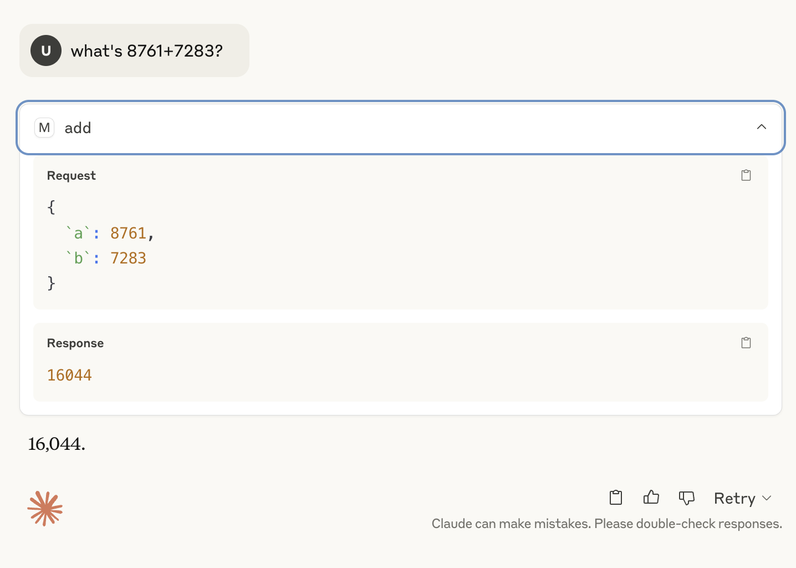
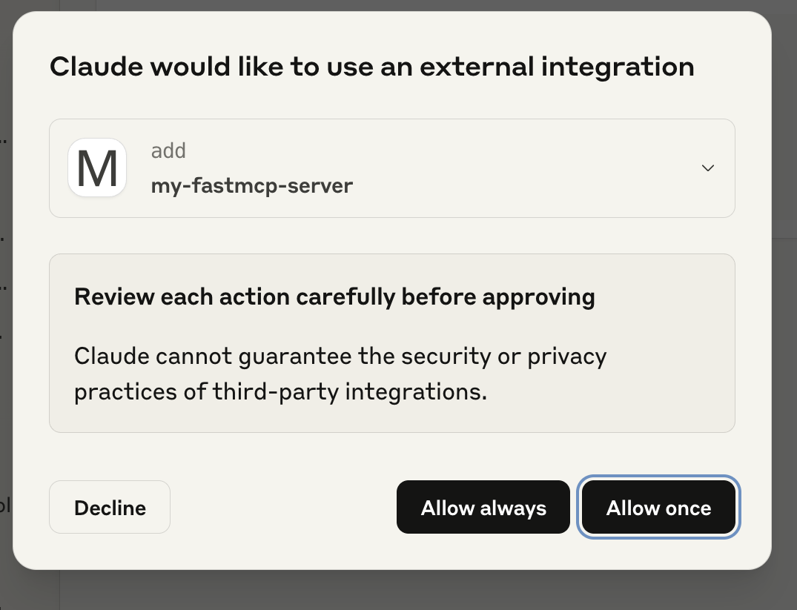

# Remote FastMCP Server - Reference Implementation

This project demonstrates a simple remote MCP (Model Context Protocol) server built using FastMCP, a Python framework. This server exposes a basic `add` tool that can be called by MCP clients, such as Claude AI Desktop, allowing the AI to perform calculations through your custom service.



## What is FastMCP?

FastMCP is a Python framework designed to help you build custom tools and services that can be exposed to AI models that support the Model Context Protocol. It allows you to create specialized functionalities (like database queries, API integrations, or custom computations) and make them available to AI agents.

## Project Files

* `my-fmcp-server.py`: The Python code for our FastMCP server.

## Features

* **Remote Accessibility**: Configured to run as a standalone server, accessible via HTTP.
* **Simple `add` Tool**: Provides a single tool that adds two integer numbers.
* **Logging**: Basic logging to show when the server receives requests and processes the `add` tool.

## Setup Instructions

Follow these steps to get your FastMCP server running and connected to Claude AI Desktop.

### 1. Install Dependencies

You'll need `uv` (recommended) or `pip` to install `fastmcp`.

```bash
# If you have uv (recommended for speed and reliability)
uv add fastmcp

# If you prefer pip
# pip install fastmcp
```

### 2. Create the Server File (`server.py`)

Create a file named `my-fmcp-server.py` and paste the following code into it:

```python
import asyncio
import logging
from fastmcp import FastMCP

# Configure basic logging for the server
logger = logging.getLogger(__name__)
logging.basicConfig(format="[%(levelname)s]: %(message)s", level=logging.INFO)

# Initialize the FastMCP server with a name
mcp = FastMCP("MyRemoteMathServer")

@mcp.tool()
def add(a: int, b: int) -> int:
    """Use this to add two numbers together."""
    logger.info(f"Received add request: a={a}, b={b}")
    return a + b

if __name__ == "__main__":
    print("Starting FastMCP server for remote access...")
    # Run the server using the "streamable-http" transport, accessible on port 8000
    # The server will listen on '0.0.0.0' to be accessible from other machines
    # The '/mcp' path is where the MCP protocol endpoint will be served.
    mcp.run(transport="streamable-http", host="0.0.0.0", port=8000)
    print("FastMCP server stopped.")
```

### 3. Run the FastMCP Server

Open your terminal, navigate to the directory where you saved `server.py`, and run the server:

```bash
python my-fmcp-server.py
```

You should see output similar to this, indicating the server is running:

```
Starting FastMCP server for remote access...
[INFO]: Starting MCP server 'MyRemoteMathServer' with transport 'streamable-http' on http://0.0.0.0:8000/mcp
INFO:     Started server process [YOUR_PROCESS_ID]
INFO:     Waiting for application startup.
[INFO]: StreamableHTTP session manager started
INFO:     Application startup complete.
INFO:     Uvicorn running on http://0.0.0.0:8000 (Press CTRL+C to quit)
```

**Keep this terminal window open and the server running** while you use Claude AI Desktop.

### 4. Configure Claude AI Desktop (or other MCP Clients)

To allow Claude AI Desktop to connect to your running FastMCP server, you need to add its configuration to Claude's `config.json` file.

1.  **Locate your Claude AI Desktop `config.json` file.** Its location varies by operating system:
    * **macOS:** `~/Library/Application Support/Claude/config.json`
    * **Windows:** `%APPDATA%\Claude\config.json`

2.  **Edit `config.json`**: Add the following entry within the `"mcpServers"` block. If `"mcpServers"` doesn't exist, you'll need to create it.

    ```json
    {
      "mcpServers": {
        // ... (other existing MCP server configurations) ...

        "my-fastmcp-server": {
          "command": "npx",
          "args": [
            "mcp-remote",
            "http://localhost:8000/mcp"
          ]
        }
      }
    }
    ```
    * **`"my-fastmcp-server"`**: This is the arbitrary name you give your server in Claude AI Desktop. You'll use this name when interacting with Claude.
    * **`"http://localhost:8000/mcp"`**: This is the crucial URL.
        * `localhost:8000` refers to your computer's IP address and the port your server is listening on.
        * `/mcp` is the specific path where the FastMCP server exposes its protocol endpoint.

3.  **Save the `config.json` file.**

4.  **Restart Claude AI Desktop.** For the new server configuration to load, you must completely quit and restart the Claude AI Desktop application.

## How to Use with Claude AI Desktop

Once your server is running and Claude AI Desktop has been restarted, you can interact with your `add` tool.



1.  **Open Claude AI Desktop.**
2.  **Start a new conversation.**
3.  **Ask Claude to use your tool.** Be explicit initially to ensure Claude uses your specific tool.

    * **Example Prompt:**
        ```
        Using the `add` tool from `my-fastmcp-server`, what is 123 + 456?
        ```
    * **Other ways to ask:**
        * "Can you use the `add` tool to calculate the sum of 50 and 75?"
        * "I need to add two numbers using `my-fastmcp-server`'s `add` tool. What's 10 + 20?"

4.  **Observe the Output:**
    * Claude AI Desktop should ask for permissions to use an external integration and then display the result (e.g., "The sum of 123 and 456 is 579.").
    * In your terminal where `server.py` is running, you should see log messages confirming the request was received and processed, for example:
        ```
        INFO:     127.0.0.1:XXXXX - "POST /mcp/ HTTP/1.1" 200 OK
        [INFO]: Received add request: a=123, b=456
        ```

Congratulations! You have successfully set up and used your first remote FastMCP server with Claude AI Desktop. You can now expand this server with more complex tools and functionalities.